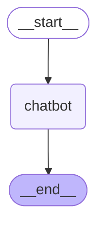

# Chatbot

A minimal yet fully functional AI chatbot built with LangGraph and Chainlit.

This project demonstrates how to create a working web-based AI chat interface with just a few files and minimal code. It connects to OpenRouter API, giving you access to various LLM models.

## Features

- Web chat interface with conversation history
- Streaming-ready architecture using LangGraph
- Easy model switching via configuration
- Clean, extensible codebase

## Quick Start

```bash
# Install dependencies
uv sync

# Configure
cp .env.example .env
# Edit .env and set your OPENROUTER_API_KEY

# Run
chainlit run app.py
```

Open `http://localhost:8000` in your browser.

## Configuration

| Variable | Description | Default |
|----------|-------------|---------|
| `OPENROUTER_API_KEY` | Your OpenRouter API key | (required) |
| `MODEL_NAME` | LLM model to use | `anthropic/claude-3.5-sonnet` |
| `TEMPERATURE` | Response randomness | `0.7` |

## Project Structure

```
├── app.py       # Chainlit UI handlers
├── graph.py     # LangGraph conversation flow
├── state.py     # Conversation state definition
└── config.py    # Settings management
```

## Graph Architecture

<!-- GRAPH:START -->

<!-- GRAPH:END -->

To regenerate the diagram run `uv run python graph.py`.

## Requirements

- Python 3.11+
- OpenRouter API key (get one at [openrouter.ai](https://openrouter.ai))
