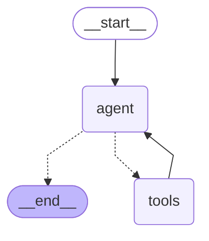

# Chatbot

A minimal yet fully functional AI chatbot built with LangGraph and Chainlit.

This project demonstrates how to create a working web-based AI chat interface with just a few files and minimal code. It connects to OpenRouter API, giving you access to various LLM models.

## Features

- AI agent with MCP (Model Context Protocol) tool support
- Configurable MCP servers via environment variables
- ABRA Gen API tools (firms, invoices, products, custom queries)
- Web chat interface with conversation history
- Easy model switching via configuration

## Quick Start

```bash
# Configure
cp .env.example .env
# Edit .env and set your API keys

# Run
./run.sh
```

Open `http://localhost:8000` in your browser.

## Configuration

| Variable | Description | Default |
|----------|-------------|---------|
| `OPENROUTER_API_KEY` | Your OpenRouter API key | (required) |
| `MODEL_NAME` | LLM model to use | `anthropic/claude-3.5-sonnet` |
| `TEMPERATURE` | Response randomness | `0.7` |
| `MCP_SERVERS` | MCP servers config (JSON) | `{}` |
| `ABRA_HOST` | ABRA Gen API URL | `http://localhost:699` |
| `ABRA_DATABASE` | Database name | `Demo` |
| `ABRA_USERNAME` | API username | (required) |
| `ABRA_PASSWORD` | API password | (required) |

## Project Structure

```
├── app.py           # Chainlit UI handlers
├── graph.py         # LangGraph agent definition
├── state.py         # Agent state definition
├── tools.py         # MCP client (loads tools from MCP servers)
├── config.py        # Settings management
└── abra_mcp/        # ABRA Gen MCP server
    ├── server.py    # MCP server (stdin/stdout)
    ├── client.py    # HTTP client for ABRA API
    ├── tools.py     # MCP tool definitions
    └── config.py    # ABRA configuration
```

## Graph Architecture

<!-- GRAPH:START -->

<!-- GRAPH:END -->

To regenerate the diagram run `uv run python graph.py`.

## Available Tools

The AI agent has access to these ABRA Gen tools:

| Tool | Description |
|------|-------------|
| `abra_query` | Flexible query on any business object collection |
| `abra_get_resource` | Get specific resource by ID |
| `abra_list_firms` | List firms/customers with search |
| `abra_list_invoices` | List invoices with date filtering |
| `abra_list_products` | List products/store cards with search |

## Adding MCP Servers

To add a new MCP server, update `MCP_SERVERS` in `.env`:

```bash
# Single server
MCP_SERVERS={"abra": {"command": "uv", "args": ["run", "python", "-m", "abra_mcp.server"], "transport": "stdio"}}

# Multiple servers
MCP_SERVERS={"abra": {"command": "uv", "args": ["run", "python", "-m", "abra_mcp.server"], "transport": "stdio"}, "another": {"command": "npx", "args": ["another-mcp-server"], "transport": "stdio"}}
```

Each server config supports:
- `command` - executable to run
- `args` - command arguments (optional)
- `transport` - `stdio` (default) or `streamable_http`
- `env` - environment variables (optional)

## Docker

### Docker Compose (recommended)

```bash
docker compose up -d      # Build and start
docker compose down       # Stop
docker compose logs -f    # View logs
```

### Manual build and run

```bash
# Build
docker build -t chatbot:latest .

# Run
docker run -d \
  --name chatbot \
  -p 8000:8000 \
  --env-file .env \
  chatbot:latest
```

## Requirements

- Python 3.11+
- OpenRouter API key (get one at [openrouter.ai](https://openrouter.ai))
- ABRA Gen with API access enabled
